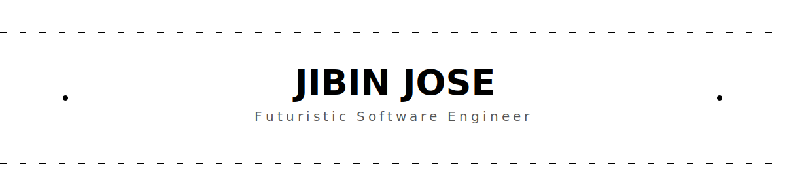

<!-- :zap: ULTRA PREMIUM FUTURISTIC README :zap: -->

<!-- TOP HEADER -->

  

<h1 align="center" style="font-family: 'Segoe UI', sans-serif;">
  
</h1>

# :milky_way: About Me

> I am a passionate developer who merges creativity with code — building futuristic, scalable applications with clean UI, solid architecture, and high-performance backend systems.

- :mag_right: Currently developing **React + NestJS + PostgreSQL** applications  
- :seedling: Exploring **Next.js, AWS, CI/CD pipelines**  
- :art: Focused on **modern UI/UX design**  
- :video_game: Exploring **3D Web + Game Development**  
- :zap: Motto: *"Coding the future, one line at a time."*

# :hammer_and_wrench: Tech Arsenal

# :globe_with_meridians: Tech Stacks 

  
  
  
  
  

# :rocket: Activity & Stats Dashboard

### :bar_chart: Contribution Graph  

  

### :fire: Streak & Stats  

  
  

# :jigsaw: Languages Overview

  

# :snake: Contribution Snake

  

# :space_invader: Space Shooter Game

  

# :cityscape: Contribution City (3D)

  

